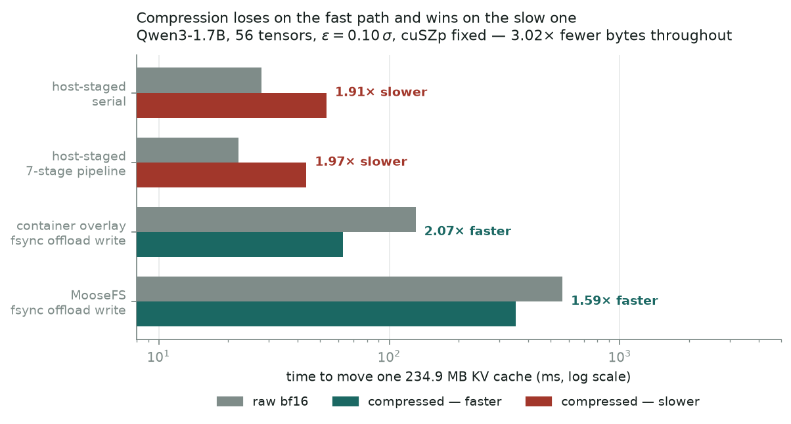
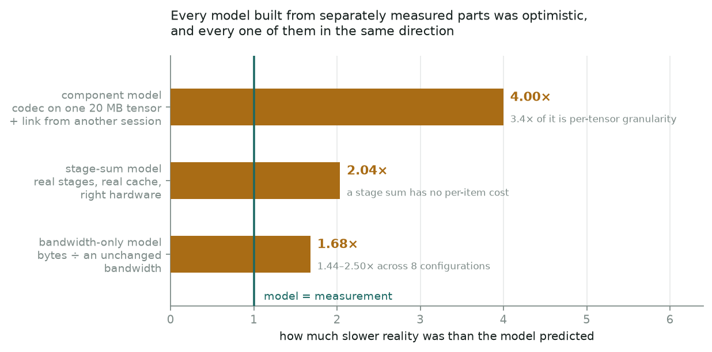
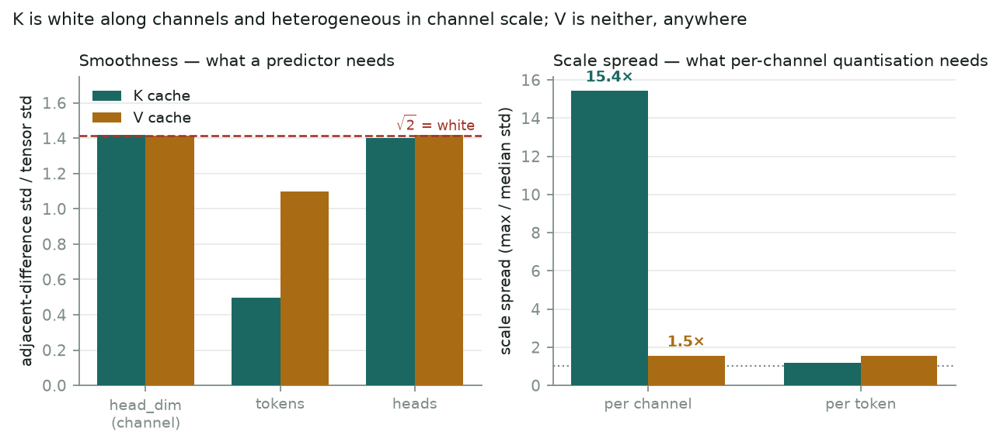

# When does error-bounded compression pay for moving LLM KV cache?

**Zhufeng Qiu** · [github.com/Zhufeng-Qiu/bound_relay_study](https://github.com/Zhufeng-Qiu/bound_relay_study)
Qwen3-1.7B, 24 WikiText-2 articles, cuSZp / SZ3 / zfp, **≈ $5** of rented GPU time.

---

## Summary

A KV cache is a natural target for error-bounded lossy compression: it is large, it
moves, and its consumers tolerate error unevenly. Whether compressing it before a
move actually pays is usually settled by a break-even model — bytes saved divided
by link bandwidth, against codec time. This study measured that decision end to end
instead of computing it.

Compression **loses** on a host-staged GPU-to-GPU path (1.97× slower, pipelined)
and **wins** on a durable filesystem offload write (1.21–2.10× faster, eight
configurations of eight). That much the model gets right — it gets the *sign*.

It gets little else. Three separate models built from correctly measured parts were
optimistic about the composition by 4×, 2.04× and 1.68×, every one of them in the
same direction. The reason is structural rather than a missing term: **the model
treats rates as properties of components when they are properties of components in
a configuration.** Codec throughput is not a codec property — the same codec runs
at 40 GB/s on one 20 MB tensor and 11.8 GB/s over a real 56-tensor cache. Link
bandwidth is not a link property — the same incompressible bytes achieve 0.55× the
throughput at 77.7 MB that they do at 234.9 MB on one mount. That second one is
fatal to the algebra: `BW` sits in the denominator of the benefit term and is a
function of the compressed size the decision sets. `break_even_BW` is therefore not
a constant of a path and cannot be looked up on an axis.

Along the way: on **three of three** rented multi-GPU pods, peer-to-peer device
copies report success and transfer nothing.

## Setup

Qwen3-1.7B pinned at `b9352fbb`, bf16, 28 layers, 8 KV heads. Twenty-four
independent WikiText-2 articles cut on the corpus's own `= Title =` markers —
documents, not slices, because the document is the independent unit and every split
depends on that. Prefixes at 64/256/1024/2048 tokens, six layers, K and V separate:
**1152 tensor observations**, plus three full 28-layer caches (234.9 MB each) for
transport. Capture is a single `model(input_ids, use_cache=True)` prefill, which is
the cache a disaggregated transfer actually moves.

Bounds are relative: `ε_i = c · σ_i`, `c ∈ {0.01, 0.03, 0.10}`. Per-tensor σ spans
115× across this corpus, so a shared absolute ε is a different bound on every
tensor and cross-tensor means computed under one are not comparisons.

## 1. Peer-to-peer copies that report success and move nothing

`torch.cuda.can_device_access_peer` returns `True` both ways.
`cudaDeviceEnablePeerAccess` returns `cudaSuccess`. `cudaMemcpyPeer` returns
`cudaSuccess`. The destination is left entirely zero — both directions, 4 B through
32 MB, ten of ten attempts, both devices fully synchronised before the copy.
Through host memory it is exact.

Three of three pods: two GPU models (A40, RTX A6000), two data centres, and both
interconnect topologies a rented pair comes in (`PXB` behind one PCIe switch,
`SYS` across the NUMA interconnect). No pod rented for this project has ever had a
working peer path.

Nothing raises and nothing warns. A KV transfer built the obvious way moves zeros
between GPUs and reports that it worked; the receiver decompresses them into a
tensor of the right shape and dtype and the model keeps generating. This is why
every transport number here is host-staged — not a limitation of the harness, the
only route that returns the bytes that were sent.

## 2. Where compression pays



One 234.9 MB cache, compressing 3.02× at `c = 0.10`. Raw verified byte for byte and
compressed at 0.9999 × ε on every configuration.

| path | raw | compressed | |
|---|---|---|---|
| host-staged, serial | 27.87 ms | 53.35 ms | 1.91× slower |
| host-staged, 7-stage pipeline | 22.19 ms | 43.65 ms | 1.97× slower |
| container overlay, `fsync` offload write | 130.0 ms | 62.9 ms | **2.07× faster** |
| MooseFS, `fsync` offload write | 563.1 ms | 354.6 ms | **1.59× faster** |

Those compared arms measured at different moments on a shared machine. Re-run
**paired** — 360 raw/compressed measurements back to back, half in each order,
across three segments of one session — the sign holds and is determinate everywhere:

| path | R = T_compressed / T_raw | 95% CI | inputs |
|---|---|---|---|
| serial | 2.10 – 6.15 | none crosses 1 | 4 / 4 slower |
| pipeline | 1.52 – 2.33 | none crosses 1 | 4 / 4 slower |
| **`fsync` write** | **0.51 – 0.74** | none crosses 1 | **4 / 4 faster** |

All three segments agree with the pooled direction, which matters because the
magnitudes do not — serial alone swings 2.64–4.22 between segments. That drift is
what pairing exists to absorb.

Pipelining moves both arms — 1.22× on the compressed path, 1.26× on the raw one —
and neither past the other. At depth 8 both host threads finish saturated with under
2.2 ms of waiting, so that is not a scheduling failure with headroom left in it.

The offload figures are **`fsync`-acknowledged writes**, not round trips. Cold
restore is not measured, and the read side of that mount is served warm at ≈3 GB/s.

## 3. Why the models failed



| model | built from | overshot by |
|---|---|---|
| component | codec on one 20 MB tensor, link from another session | **4×** |
| stage-sum | the real stages, on the real cache, on the right hardware | **2.04×** |
| bandwidth-only | bytes ÷ an unchanged bandwidth | **1.68×** (1.44–2.50 over 8 configs) |

The second is the interesting one. Its inputs were not sloppy: per-stage costs
measured on the actual 56-tensor cache, on the machine that would run it. Grouped
by resource they predict a pipeline at 21.43 ms; the pipeline measures 43.65 ms. A
stage sum contains no per-item cost, and per-item cost is where composition lives.

The third breaks the algebra rather than a term. Writing incompressible noise
through one call pattern and changing only the volume:

| | 77.7 MB | 234.9 MB | the small payload gets |
|---|---|---|---|
| MooseFS, `fsync` | 0.255 GB/s | 0.468 GB/s | **0.55×** |
| container overlay, `fsync` | 1.820 GB/s | 2.097 GB/s | 0.87× |

Bandwidth is a function of how much you write, most strongly on the network
filesystem under durability — which is the configuration an offload runs in. So the
denominator of `bytes ÷ bandwidth` depends on its numerator, and the crossing is
not a property of the path. On this project's own numbers it moved from 3.82 to
5.38 GB/s on one machine and one cache when only the schedule changed.

Per-object cost is absent from the expression entirely, and dominated: fifty-six
files cost **4.3×** one file on identical bytes.

**What survives is the sign, not the magnitude.** Compression is worth it on slow
durable paths and not on fast ones. Where the crossing sits cannot be computed; it
has to be measured at the granularity and durability that will actually run.

## 4. Keys and values are not the same data



Given SZ3 with a per-tensor oracle over all 28 configurations `pysz` can reach —
algorithm, interpolation kernel and direction, Lorenzo and regression flags — while
`NOPRED` keeps one frozen default, no-prediction still beats every predictor on
**28 of 28 value tensors** at every `c`, and loses on 22 of 28 key tensors.

The mechanism is measurable and it is two statistics, not one:

| | K | V |
|---|---|---|
| adjacent-difference std / σ, along channels | 1.417 (white) | 1.413 (white) |
| adjacent-difference std / σ, along tokens | **0.50** | 1.10 |
| per-channel scale spread (max/median) | **15.4×** | 1.54× |
| per-token scale spread | 1.19× | 1.55× |

*Medians over 28 tensors of each kind; the scale statistic is skewed (K's channel
spread has mean 25.4× against median 15.4×), so medians throughout.*

Keys carry correlation on exactly one axis — tokens — and enormous scale
heterogeneity across channels. Values carry neither, anywhere. Across tensors,
`NOPRED`'s advantage correlates with the token-axis statistic at **+0.42**.

Those two rows answer to two different designs and both are right. A predictor
needs smoothness and finds none along channels; per-channel quantisation needs
scale heterogeneity and finds 15× of it. KIVI and PackKV quantise K channel-wise
citing channel correlations, and this result agrees with them while also explaining
why SZ3's prediction stage does not pay here.

Downstream, the asymmetry reverses in a useful way — and this is the one result
here that has been re-tested on data the project had never read. On **32 held-out
WikiText-2 articles**, frozen before the numbers existed and sharing no title or
body with the 24 used to develop the project, at payloads within 0.5% of each other:

| arm | ΔNLL | 95% CI | perplexity | articles worse |
|---|---|---|---|---|
| K-only | **+0.0155** | [+0.0068, +0.0235] | **+1.56%** | 26 / 32 |
| V-only | **−0.0278** | [−0.0320, −0.0234] | **−2.74%** | 1 / 32 |
| K+V | −0.0134 | [−0.0235, −0.0042] | −1.33% | 11 / 32 |

All three intervals exclude zero, and the development set had said the same thing
on disjoint articles (+0.0228 / −0.0323). **Compressing keys costs perplexity;
compressing values does not.**

The V improvement replicates too — 31 of 32 articles, having been 16 of 16 — which
removes *sample* as its explanation and removes nothing else. It is not evidence
that lossy compression improves a language model: one model, one bound, 256
teacher-forced positions per article, one reconstruction. The claim the byte
argument needs is the weaker one, and it is now firm on held-out data: the error
budget on V costs nothing.

## Method

Twenty-two claims in this study have been withdrawn or conditioned and three
defects found in its own measurement code, each marked in place in the document
that made it and listed in [`docs/corrections.md`](docs/corrections.md). Two of the
defects were found by adversarial audit and one by building a control for an
unrelated experiment. The largest single cause was an undocumented API contract:
cuSZp requires **zeroed buffers on both sides** — it reads past `cmpSize` and does
not write elements it expects to be zero — and `torch.empty` put the allocator's
leftovers into reconstructions. That invalidated three findings, two of which had
already been written up. Measured correctly, cuSZp has **0 bound violations**.

Superseded work is under `results/public/superseded/` with its retraction markers
intact rather than deleted. Every GPU session is in
[`docs/budget_ledger.md`](docs/budget_ledger.md) with its purpose recorded before
it started.

## Limits

One model, one corpus, one codec family, one provider. Cross-pod absolute
comparisons are not safe: identical code differed 6–19% between two A40 pods, which
is the size of several effects reported here. The peer-copy failure is
characterised, not diagnosed — cause and prevalence both need host access a rented
pod does not have. The K/V mechanism rests on one document's full 28-layer cache:
the depth axis is complete, the document axis is not. `fsync` is the only durability
model tested. And no better closed-form model is offered here — the result is that
the quantity is less portable than it looks, not that a different formula fixes it.

## Reproduction

```bash
uv sync --extra dev && uv run pytest        # 114 tests, no GPU
```

`docs/environment.lock.md` pins every version and host. Levels L0–L4 in the
[README](README.md) say which experiments need no GPU, one, or two.
