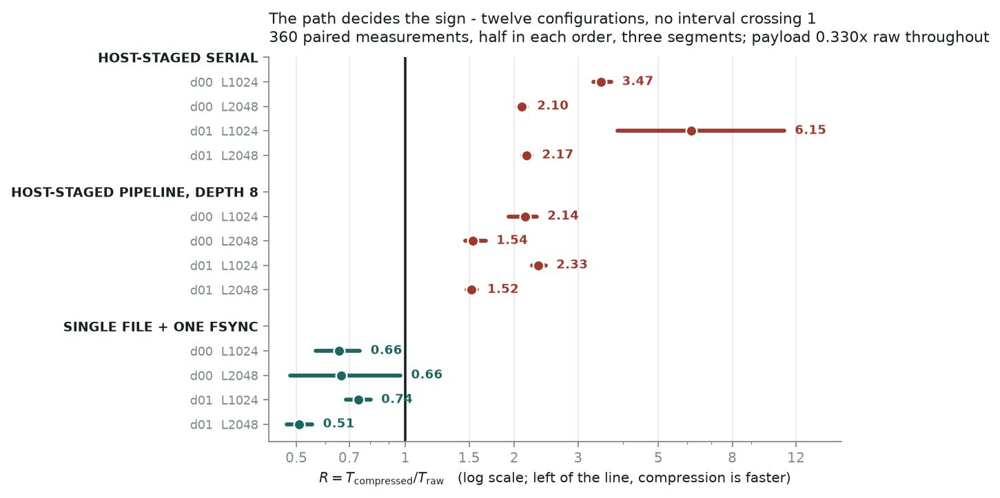
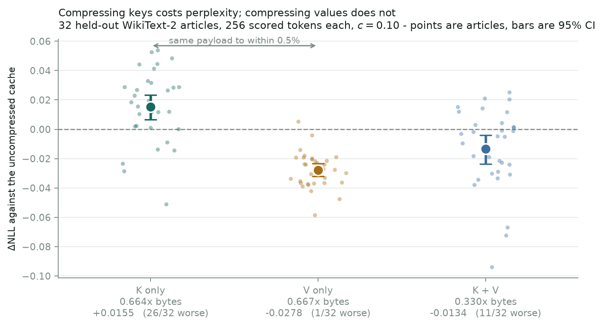

# BoundRelay

**When does error-bounded compression pay for LLM state movement?**

A measurement study of disaggregated prefill–decode KV transfer, KV migration and
cache offloading. The codec is a controlled variable, not the contribution.

> **Status: closed.** Every claim below is measured, and every claim this project
> has withdrawn is marked in place in the document that made it and listed in
> `docs/corrections.md`. Superseded work is under `results/public/superseded/`,
> not deleted. Nothing here is a placeholder.

> **[Read the research note →](NOTE.md)** — four pages: what was measured, what it
> cost, and which of this project's own models did not survive it.

## The question

Components benchmarked independently predict one thing; a real KV cache moving
end to end does another. This project measures the gap and what causes it — and
the largest single cause turned out not to be the codec.

## What is measured

| | |
|---|---|
| Model | Qwen3-1.7B, revision `b9352fbb`, bf16, 28 layers, 8 KV heads |
| Corpus | 24 WikiText-2 articles → **1152 tensor observations**; plus **32 held-out articles** frozen for the quality re-test |
| Bounds | `eps_i = c · std_i`, `c ∈ {0.01, 0.03, 0.10}` |
| Compressors | cuSZp (3 modes) · SZ3 (28-configuration scan) · CUDA zfp · int8 baselines |
| Transport | one real 56-tensor, 234.9 MB full cache, host-staged, 2×A40 and 2×A6000 |
| Quality | 16 documents, 1024→128 tokens, real cuSZp round trip ending in bf16 |
| Spend | **≈ $5** of GPU rental |

## Findings

**Peer-to-peer GPU copies report success and transfer nothing.**
`can_device_access_peer` returns `True`, `cudaMemcpyPeer` returns `cudaSuccess`,
and the destination is left entirely zero — both directions, 4 B through 32 MB, ten
of ten attempts, fully synchronised. Through host memory it is exact. **Three of
three rented pods**: two GPU models, two data centres, and both interconnect
topologies a rented pair comes in (PXB and SYS). A KV transfer built the obvious
way moves zeros between GPUs and reports that it worked.
→ `results/public/peer_copy_findings.md`

**Models built from separately measured parts are optimistic, twice over.**
A component model — codec throughput from one 20 MB tensor, link from another
session — was **4× optimistic**; per-tensor granularity was the cause. A stage-sum
model built from the *right* stages, on the real cache, on the right hardware was
still **2× optimistic** about a real pipeline: predicted 21.43 ms, measured 43.65,
because a stage sum contains no per-item cost. Measured on one host, compressed is
**1.91×** raw serial and **1.97×** pipelined — pipelining moves both arms and
neither past the other.
→ `results/public/c_transport_findings.md`, `pipeline_findings.md`

**Pipelining moves both arms and neither past the other.** A real seven-stage
pipeline, with the raw path through identical machinery: compressed 43.65 ms against
raw 22.19 ms, **1.97×** — against 1.91× for the same two paths run serially. The
stage-sum model said 21.43 ms and was optimistic by 2×; both threads finish
saturated with under 2.2 ms of waiting, so there is no headroom left to schedule.
The break-even moves from 3.82 to **5.38 GB/s**, not the 10.96 the model implied.
→ `results/public/pipeline_findings.md`, `gate2_findings.md`



**Paired and interleaved, the path sets the sign — twelve configurations, twelve
determinate answers.** Every earlier performance number here compared a raw loop
against a compressed loop measured at a different moment on a shared machine. Paired
— 360 raw/compressed measurements taken back to back, half in each order, across
three segments — compression is slower on both GPU-to-GPU paths on all four inputs
(serial R = 2.10–6.15, pipeline R = 1.52–2.33) and faster on an `fsync`-acknowledged
filesystem write on all four (R = 0.51–0.74). **No interval crosses 1**, and all
three segments agree with the pooled direction, which matters because the magnitudes
do not: serial alone swings 2.64–4.22 between segments.
→ `results/public/protocol_2026_09_17/b2_findings.md`

**A reused buffer delivers the right bytes, and two things about the codec were
not known.** 2,240 round trips through one pool — large→small→large, same-length
different-content, deliberately soiled — **zero mismatches in either the fp32
reconstruction or the delivered bf16** against 448 freshly-zeroed baselines. On the
two-device path, **1,792 per-tensor comparisons at depth 1 and 8 are byte-exact**:
the transport is not within a bound, it is exact. cuSZp's decompress **never reads its `cmpSize` argument**:
declaring 64 bytes in place of 628,536 returns a bit-identical reconstruction, which
gives the previously-inferred zeroed-buffer contract a mechanism. And the codec
exceeds its own error bound by up to **1.0000015 × ε** — a few float32 ulps *of ε*,
so no absolute tolerance is the right shape for it.
→ `results/public/protocol_2026_09_17/b0_findings.md`

**Compression is 1.97× slower on the host-staged pipeline and 1.2–2.1× faster for
an `fsync`-acknowledged filesystem offload write — and never the 3.02× its byte
reduction implies.** Eight configurations across two filesystems, raw verified byte
for byte and compressed at 0.9999 × ε in all of them. A bandwidth-only model
predicts 3.02× everywhere and is short by 1.44–2.50×, because **achieved bandwidth
is a function of how much you write**: the same incompressible bytes at 77.7 MB get
0.55× the throughput they get at 234.9 MB on that mount. The denominator of
`bytes ÷ bandwidth` depends on its numerator. Durability moves the ratio in
*opposite directions* on the two filesystems and never flips the sign.
→ `results/public/fsync_offload_findings.md`
→ `results/public/gate2_findings.md`



**Keys and values are not equally safe to compress.** At payloads within 0.4% of each
other (0.664 against 0.667), K-only compression costs **+1.56%** of perplexity
(ΔNLL +0.0155, CI [+0.0068, +0.0235], **26 of 32 articles worse**) and V-only
*improves* it (ΔNLL −0.0278, CI [−0.0320, −0.0234], **31 of 32 better**).
**Replicated on 32 held-out articles**, frozen before the numbers existed, with no
title or body overlap with the 24 this project developed on — though that run
carries a recorded protocol deviation: 2 of 3,584 tensors missed the pre-declared
error tolerance and the stop rule was relaxed mid-round rather than halting — the development set
said the same thing on disjoint articles. The V improvement is now observed twice
and explained neither time. Compressing both ships **0.330×** the bytes.
→ `results/public/protocol_2026_09_17/b1_findings.md`, `d_quality_findings.md`
→ `results/public/d_quality_findings.md`

**SZ3's predictor costs ratio on values and pays on keys.** Given every configuration
`pysz` can reach — 28 of them, chosen per tensor as an oracle — no-prediction still
beats the best predictor on **28 / 28 value tensors** at every `c`, and loses on 22 of
28 key tensors. The mechanism is measured: adjacent-difference std over tensor std is
√2 (white) along channels and heads for both kinds, and **0.50 for K against 1.10 for
V along the token axis**. The cache carries correlation on one axis, mostly for keys.
→ `results/public/a3_sz3_full_findings.md`

**Characterization.** cuSZp is flat on this corpus — about 10% spread across every
layer, both kinds and four sequence lengths. Request metadata alone (layer, K/V,
sequence length, ε) predicts the compressed size to **within 1%**; a pass over the
tensor buys a further 11%.
→ `results/public/b0_corpus_findings.md`, `b1_predictability_findings.md`

**An undocumented API contract invalidated three findings.** cuSZp requires zeroed
buffers on both sides — it reads past `cmpSize` and does not write elements it
expects to be zero — and `torch.empty` put the allocator's leftovers into the
reconstruction. Re-measured on that audit's 56 tensors: **0 bound violations**,
worst error 1.000× ε. That is a statement about that sample and that stage — the
later held-out round measured **2 of 3,584** compressed tensors above `ε + 1e-6`,
and relaxed the stop rule rather than halting (see below).
→ `results/public/remeasure_findings.md`, `DEFECTS.md`

## What is not established

* One model, one corpus, one GPU generation (`sm_86`), one link speed.
* The break-even (3.82 GB/s) is **implied by measured costs, not measured** — no
  experiment sits on the other side of the crossing.
* The peer-copy failure is characterised, not diagnosed: cause and prevalence both
  need host-level access a rented pod does not have.
* The SZ3 mechanism result rests on one document's full 28-layer cache; the depth
  axis is complete, the document axis is not.
* Payload corruption, bit flips and retransmission are out of scope.

## Corrections

Twenty-two claims have been withdrawn or conditioned, each marked in place in the
document that made it. `docs/corrections.md` is the register.

## Reproduction

**The current round is the 2026-09-17 protocol** (`results/public/protocol_2026_09_17/`).
Its frozen inputs are `protocol.json` (seeds, tolerances, thresholds),
`heldout_manifest.json` (the 32 articles, with token hashes) and
`seen_documents.json`; the machine it ran on is in `b0/environment.json`, which pins
the cuSZp commit and the built library's sha256.

| level | what | needs a GPU? |
|---|---|---|
| **L0** | `uv run pytest` — codec property tests, both suites | no |
| **L1** | `scripts/freeze_manifest.py` (re-derives the frozen list), `scripts/sz3_full_scan.py`, `scripts/predictability.py` | no |
| **L2** | `scripts/capture_corpus.py --docs 2 --full-cache-docs 2 --lengths 1024 2048 --full-cache-lengths 1024 2048`, then `scripts/quality_holdout.py` (B1) and `scripts/scoring_alignment_diag.py` | one GPU |
| **L3** | `scripts/validate_reuse.py` (B0), `scripts/benchmark_paths.py` (B2; `--verify-only` for the per-tensor correctness pass), `scripts/peer_copy_audit.py` | two GPUs |
| **L4** | `scripts/fsync_offload.py`, `scripts/storage_bandwidth.py` — needs a real filesystem under `/workspace`; the numbers are that mount's, not a property of the filesystem | one GPU |

`scripts/run_protocol_session.sh` runs capture → B0 → B1 → B2 in order and stops if
B0 fails. **Earlier rounds** used `quality_d.py`, `quality_contrast.py`,
`transport_e2e.py`, `gate2_rerun.py` and `pipeline_multistage.py`; those reproduce
the superseded results under `results/public/superseded/` and the pre-protocol
findings, not the numbers on this page.

```bash
uv sync --extra dev && uv run pytest
```

## Layout

```
boundrelay/codec/          contract, reference, allocation, packing, Triton kernel, cuSZp bridge
boundrelay/policy/         break-even cost model, decision rule
boundrelay/bench/          Table A, Table B, quality
scripts/                   capture, benchmarks, transport, analysis
docs/                      corrections, environment lock, budget ledger, codec contract
results/public/            findings and sanitised JSON — current claims
results/public/superseded/ replaced, withdrawn and early-phase work, markers intact
```
